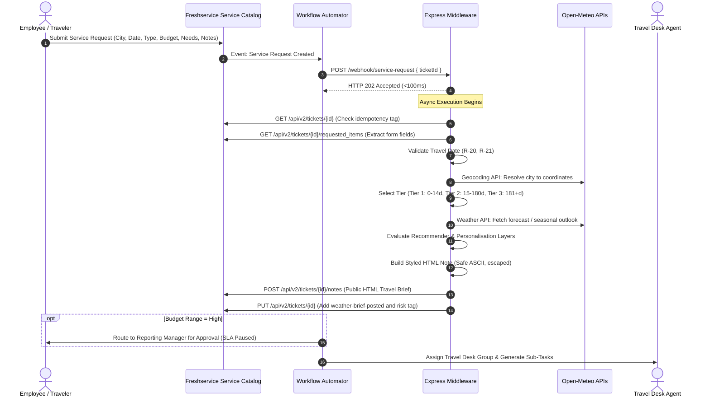

# Weather-Based Travel Recommendation

Production-grade Weather Intelligence and Travel Recommendation middleware for Freshservice Service Catalog.
Built as a technical screening assignment submission for Haass.io (Chennai).

---

## 1. Executive Summary

This repository implements a complete end-to-end integration between Freshservice Service Catalog and Open-Meteo weather intelligence. When an employee requests travel in Freshservice, the system automatically resolves the destination city coordinates, retrieves tiered weather forecasts, evaluates a deterministic recommendation engine with composite risk scoring, applies trip-type and budget personalisation, generates health and accessibility cautions, and posts a branded, accessible HTML travel brief note directly onto the ticket conversation.

### Evaluation Criteria Matrix

| Evaluation Dimension | Solution Architecture | Reference Documentation |
|:---|:---|:---|
| **Form Design & Rules** | Service Catalog item with 6 fields and 2 dynamic Business Rules (BR-WTR-01, BR-WTR-02) implementing progressive field disclosure and conditional notes. | [docs/01-requirements-analysis.md](docs/01-requirements-analysis.md)<br>[docs/05-freshservice-configuration-guide.md](docs/05-freshservice-configuration-guide.md) |
| **API Integration** | Node.js 24 Express middleware deployed on Render; Basic Auth; <100ms HTTP 202 webhook response; Open-Meteo Geocoding, Forecast, and Seasonal APIs. | [docs/02-architecture.md](docs/02-architecture.md)<br>[docs/references.md](docs/references.md)<br>[docs/04-deployment-guide.md](docs/04-deployment-guide.md) |
| **Workflow Automation** | Multi-branch Freshservice Workflow Automator: manager approval routing on High budget with SLA pause; Low/Medium bypass; Travel Desk task creation. | [docs/05-freshservice-configuration-guide.md](docs/05-freshservice-configuration-guide.md) |
| **Creativity in Output (WOW Feature)** | 0-100 composite risk scoring, 3-tier horizon selector (0-14d forecast, 15-180d seasonal, 181+d baseline), trip-type tailoring, budget adjustments, and special-needs keyword awareness. | [docs/03-demo-guide.md](docs/03-demo-guide.md)<br>[middleware/src/engine/personaliser.js](middleware/src/engine/personaliser.js) |

---

## 2. Architecture & Data Flow



---

## 3. Key Architectural Decisions (ADR Summary)

All architecture decisions are formally recorded in [`docs/adr/`](docs/adr/):

- **ADR-001 (Middleware Approach):** Dedicated Express microservice hosted on Render. Returns HTTP 202 within <100ms, eliminating Freshservice 15-second webhook timeout constraints.
- **ADR-002 (Open-Meteo Provider):** Free non-commercial tier with up to 10,000 calls/day and 600/min. No API keys required, eliminating demo credential failures.
- **ADR-003 (Dynamic Geocoding):** Users can enter any global city; coordinates, admin region, and country are resolved dynamically via GeoNames.
- **ADR-004 (3-Tier Weather Horizon):** Overcomes standard 14-day forecast numerical model limits by transparently falling back to seasonal ensemble predictions (15-180 days) or climate baseline (181+ days).
- **ADR-005 (Stateless Tag Idempotency):** Freshservice retries webhooks up to 4 times; the middleware checks the `weather-brief-posted` tag to guarantee zero duplicate notes without database dependencies.
- **ADR-006 (Zero External Runtime Dependencies):** Uses native Node 24 `fetch`, `AbortController`, and `crypto.timingSafeEqual` with Express, Helmet, and express-rate-limit.
- **ADR-007 (Deterministic Rules vs LLMs):** Fast (<50ms execution), 100% predictable, zero hallucinations, zero token costs, and 100% test coverage.
- **ADR-008 (No-Mocks Testing Policy):** Unit tests execute against pure literal inputs and native Node 24 runtime; live contract tests validate upstream Open-Meteo APIs.
- **ADR-009 (Container Strategy):** Non-root multi-stage Docker image pinned to `node:24.21.0-bookworm-slim` with built-in healthcheck probes.

---

## 4. Repository Structure

```text
haass-pro/
├── .github/                      # CI/CD workflows and issue/PR templates
│   └── workflows/ci.yml          # Automated CI pipeline
├── docs/                         # Architecture, guides, and specifications
│   ├── 01-requirements-analysis.md
│   ├── 02-architecture.md
│   ├── 03-demo-guide.md          # Complete review call presentation script
│   ├── 04-deployment-guide.md    # Render and Docker deployment manual
│   ├── 05-freshservice-configuration-guide.md # Tenant configuration manual
│   ├── references.md             # External sources and empirical findings
│   ├── known-limitations.md      # Trade-offs and operational limitations
│   └── adr/                      # Architecture Decision Records (ADR-001 to 009)
├── middleware/                   # Node.js 24 Express microservice
│   ├── src/
│   │   ├── config.js             # Configuration validation and constants
│   │   ├── logger.js             # Structured Pino-compatible JSON logger
│   │   ├── server.js             # Express app, security, and webhook endpoint
│   │   ├── orchestrator.js       # End-to-end asynchronous pipeline
│   │   ├── engine/
│   │   │   ├── recommender.js    # Rule evaluation and 0-100 risk scoring
│   │   │   ├── personaliser.js   # Trip-type, budget, and accessibility layers
│   │   │   ├── note-builder.js   # Freshservice HTML note generator
│   │   │   ├── normaliser.js     # WeatherData internal shape normalizer
│   │   │   └── wmo-codes.js      # WMO 4677 weather code mapper
│   │   ├── freshservice/
│   │   │   └── client.js         # Freshservice REST API v2 client
│   │   ├── geocoding/
│   │   │   └── client.js         # Open-Meteo geocoding client
│   │   ├── providers/
│   │   │   ├── forecast.js       # Daily forecast and current weather
│   │   │   ├── seasonal.js       # 6-month seasonal climate ensemble
│   │   │   └── tier-selector.js  # 3-tier horizon selector
│   │   └── validation/
│   │       ├── date-rules.js     # Pure date rules (R-20 to R-23)
│   │       └── sanitise.js       # Safe HTML escaping
│   ├── test/
│   │   ├── unit/                 # 123 mock-free unit tests (93%+ coverage)
│   │   └── live/                 # Live contract tests against Open-Meteo
│   ├── Dockerfile                # Multi-stage non-root container definition
│   └── package.json
├── render.yaml                   # Infrastructure-as-Code blueprint for Render
├── samples/                      # Empirical test findings
│   └── note-posting-test-result.md
└── scripts/                      # Operational and demo tooling
    ├── check-no-emoji.js         # Zero-emoji verification script
    ├── warmup.js                 # Pre-demo warm-up script (Render cold-start mitigation)
    ├── simulate-webhook.js       # Webhook dispatcher CLI
    └── run-demo-scenarios.js     # Local evaluation of 4 review call scenarios
```

---

## 5. Quick Start Guide

### 5.1 Prerequisites
- **Node.js:** v24.x LTS (compatible with v20+)
- **npm:** v10.x+
- **Git**

### 5.2 Local Installation & Setup

```bash
# Clone the repository
git clone https://github.com/ChilliRoger/haass-pro.git
cd haass-pro/middleware

# Install dependencies
npm ci

# Configure environment variables
cp ../.env.example .env
```

### 5.3 Run Tests & Verification

```bash
# Run 123 mock-free unit tests with coverage
npm test

# Run code style formatting check
npm run format:check

# Run linter
npm run lint

# Run strict zero-emoji check across repository
npm run check:no-emoji

# Run live contract tests against Open-Meteo APIs (requires internet)
npm run test:live
```

### 5.4 Run Local Demo Scenarios

Execute the 4 presentation scenarios locally:

```bash
npm run demo:scenarios
```

### 5.5 Start Middleware Server

```bash
npm start
# Server listens on http://localhost:3000
```

---

## 6. Review Call Presentation Runbook

A complete presentation runbook with script, talking points, and contingency steps is provided in:
[**docs/03-demo-guide.md**](docs/03-demo-guide.md)

### The 4 Demonstration Scenarios

1. **Scenario 1 (Tier 1 Forecast, Go):** Kyoto, Japan (7 days ahead, Vacation, Medium Budget). Displays sunny outlook, verdict `[ GO ]`, low risk score (0/100), and `weather-risk-low` tag.
2. **Scenario 2 (Tier 1 Extreme Storm, Reconsider):** Miami, USA (3 days ahead, Adventure, Medium Budget). Displays thunderstorm alert, gale-force winds, verdict `[ RECONSIDER ]`, risk score (100/100), and `weather-risk-high` tag.
3. **Scenario 3 (Tier 2 Seasonal, Go with Caution):** Zurich, Switzerland (75 days ahead, Business, High Budget). Displays seasonal horizon label, winter advisory, premium chauffeur transfer advice, and triggers reporting manager approval.
4. **Scenario 4 (Accessibility & Health Advisory):** London, UK (11 days ahead, Vacation, Low Budget, Special Needs checked). Displays orange Accessibility Advisory card with wet ramp alerts, senior hypothermia precautions, and wheelchair device poncho checklist.
5. **Scenario 5 (Date Boundary Rejection):** Past date or >12 months. Displays immediate validation notice: `"Travel Date cannot be in the past."` (R-20).

---

## 7. Data Attribution

- **Weather Data:** Provided by [Open-Meteo](https://open-meteo.com/) under Creative Commons Attribution 4.0 International (CC BY 4.0).
- **Geocoding Data:** Provided by [GeoNames](https://www.geonames.org/) via Open-Meteo Geocoding API.
- All attribution links are embedded in ticket notes and documentation in compliance with licensing requirements.

---

## 8. License

This project is licensed under the MIT License - see the [LICENSE](LICENSE) file for details.
