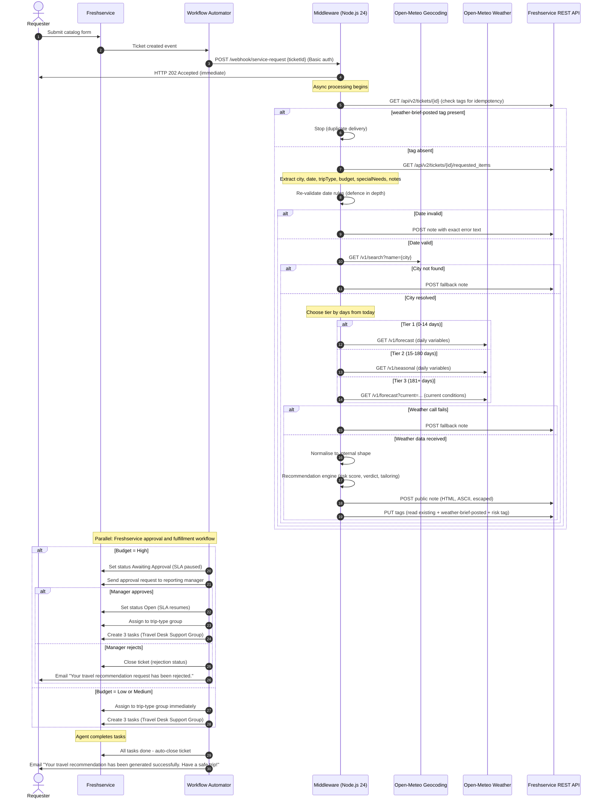

# 02 - Architecture

Purpose: Define the system architecture, data flow, component responsibilities, and design
decisions for the Weather-Based Travel Recommendation middleware.
Scope: Freshservice catalog, Workflow Automator, middleware (Node.js 24 + Express), Open-Meteo
APIs, and Render hosting.
Last verified: 2026-09-30

---

## 1. System Overview

```
+------------------+        Service Request        +---------------------+
|  Freshservice    |  --------------------------->  |  Workflow Automator |
|  Service Catalog |                                |  (WF-WTR-01)        |
+------------------+                                +---------------------+
                                                           |
                                                   POST /webhook/service-request
                                                   Basic auth, body: {ticketId}
                                                           |
                                                           v
                                                  +------------------+
                                                  |   Middleware     |
                                                  |  (Node.js 24)    |
                                                  |  Render free     |
                                                  +------------------+
                                                    |           |
                                             Geocoding       Forecast /
                                             API             Seasonal API
                                                    |           |
                                          +---------+-----------+---------+
                                          |      Open-Meteo               |
                                          |  geocoding-api.open-meteo.com |
                                          |  api.open-meteo.com           |
                                          |  seasonal-api.open-meteo.com  |
                                          +-------------------------------+
                                                    |
                                          +------------------+
                                          |  Freshservice    |
                                          |  REST API v2     |
                                          |  (read + write)  |
                                          +------------------+
```

---

## 2. Request Lifecycle Sequence



---

## 3. Middleware Component Map

```
middleware/src/
  server.js          - Express app setup, route mounting, graceful shutdown
  config.js          - Env var validation at startup, named constants
  logger.js          - Structured JSON logger (pino-compatible interface, no pino dep)

  providers/
    forecast.js      - Open-Meteo Forecast API client (tier 1 and tier 3 current)
    seasonal.js      - Open-Meteo Seasonal API client (tier 2)
    tier-selector.js - Choose tier by days from today using named constants

  geocoding/
    client.js        - Open-Meteo Geocoding API client

  engine/
    normaliser.js    - Map raw API response to internal WeatherData shape
    wmo-codes.js     - WMO weather code to condition label mapper
    recommender.js   - Pure functions: risk score, verdict, trip-type tailoring
    personaliser.js  - Budget and special-needs awareness layers
    note-builder.js  - Assemble final HTML note string (ASCII only, user text escaped)

  freshservice/
    client.js        - Freshservice API: getTicket, getRequestedItems, addNote, updateTags
    field-discovery.js - Dynamic custom field key resolution with env overrides

  validation/
    date-rules.js    - Pure functions: isPast, isBeyond12Months (take today as argument)
    sanitise.js      - HTML-escape for user-provided text before embedding in notes

  webhook-handler.js - Orchestrate steps 1-7 of Section 5 of the brief
```

---

## 4. Data Shapes

### WeatherData (internal normalised shape)

```
{
  tempC:          number | null,   // temperature_2m_max or current temperature
  feelsLikeC:     number | null,   // apparent_temperature_max (tier 1 only)
  rainChancePct:  number | null,   // precipitation_probability_max (tier 1 only)
  precipSumMm:    number | null,   // precipitation_sum (all tiers)
  uvIndex:        number | null,   // uv_index_max (tier 1 only)
  windKmh:        number | null,   // wind_speed_10m_max (all tiers)
  gustsKmh:       number | null,   // wind_gusts_10m_max (tier 1 only)
  condition:      string,          // WMO code mapped to English label
  wmoCode:        number | null,
  source:         "forecast" | "seasonal" | "current",
  confidence:     "Forecast-based" | "Seasonal outlook, low confidence" | "Current conditions only, not a prediction"
}
```

### RecommendationOutput

```
{
  riskScore:    number,  // 0-100
  verdict:      "Go" | "Go with caution" | "Reconsider",
  riskTag:      "weather-risk-low" | "weather-risk-medium" | "weather-risk-high",
  headline:     string,  // one-sentence summary
  details:      string[], // bullet points (trip-type tailored)
  packingList:  string[], // 3-5 items
  cautions:     string[], // special-needs cautions (may be empty)
  confidence:   string,  // from WeatherData.confidence
  place:        string,  // "London, England, United Kingdom"
  attribution:  string   // "Weather data: Open-Meteo (CC BY 4.0) / GeoNames"
}
```

---

## 5. Named Constants (defined in config.js, all documented)

| Constant | Value | Description |
|----------|-------|-------------|
| FORECAST_MAX_DAYS | 14 | Days from today within tier-1 forecast (live-tested 2026-09-30) |
| SEASONAL_MAX_DAYS | 180 | Days from today within tier-2 seasonal (live-tested 2026-09-30) |
| TEMP_HOT_C | 35 | Temperature threshold for heat warnings |
| TEMP_WARM_C | 28 | Temperature threshold for warm advisory |
| TEMP_COLD_C | 5 | Temperature threshold for cold warnings |
| RAIN_HIGH_PCT | 60 | Rain probability threshold for high rain warning |
| RAIN_MODERATE_PCT | 30 | Rain probability threshold for moderate rain advisory |
| UV_HIGH | 6 | UV index threshold for high UV warning |
| UV_VERY_HIGH | 8 | UV index threshold for very high UV warning |
| WIND_STRONG_KMH | 50 | Wind speed threshold for strong wind warning |
| WIND_VERY_STRONG_KMH | 75 | Wind speed threshold for storm warning |

---

## 6. Workflow Automator Naming Convention

| ID | Name | Trigger | Purpose |
|----|------|---------|---------|
| WF-WTR-01 | Trigger Webhook | Ticket created; catalog item match | POST to middleware with ticket id |
| WF-WTR-02 | Approval | Ticket created; Budget = High | Send for manager approval; reject branch closes |
| WF-WTR-03 | Group Assignment | Post-approval (or immediate for Low/Medium) | Route to trip-type agent group |
| WF-WTR-04 | Task Creation | Post-approval (or immediate for Low/Medium) | Create 3 tasks in Travel Desk Support Group |
| WF-WTR-05 | Task Closure | Module = Tasks; all tasks resolved | Close parent ticket; trigger completion email |

Business Rule naming: BR-WTR-01, BR-WTR-02, etc.

---

## 7. Security Boundaries

- Webhook authentication: HTTP Basic, constant-time comparison, secret from env.
- No Freshservice credentials in webhook payload; middleware fetches form data via API.
- All user-provided text (city, notes) HTML-escaped before embedding in ticket notes.
- Body size limit on webhook endpoint (1 KB; payload is only the ticket id).
- Rate limiting on the middleware (configurable via RATE_LIMIT_RPM env var).
- Helmet security headers on all routes.
- No secrets in git history (gitleaks in CI; .env gitignored).

---

## 8. Hosting and Deployment

- Platform: Render free tier (single instance, no persistent disk).
- Warm-up: Hit GET /health a few minutes before the demo to avoid cold-start failure.
- Cold-start behaviour: First webhook call after idle will time out (15s); Freshservice retries
  at 3 minutes. Second attempt will succeed if the service has warmed up by then.
- Environment: All secrets via Render environment variables, never in source.
